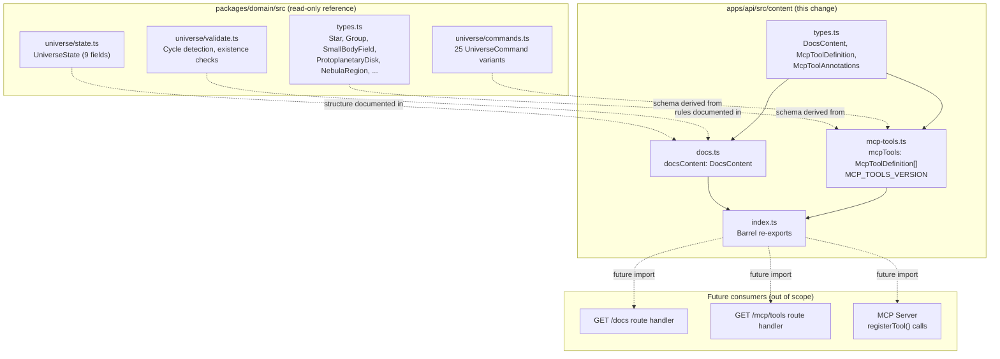

# Design: mcp-docs-and-tools

**Change**: `mcp-docs-and-tools`
**Phase**: Design
**Status**: Draft
**Date**: 2026-02-24

---

## Technical Approach

This change populates four files within `apps/api/src/content/` to create a self-contained content layer: typed interfaces, structured documentation, MCP tool specifications, and a barrel re-export.

The content module follows the **pure data export pattern** already signaled by the three empty placeholder files. Each module exports typed constants with zero runtime I/O, zero framework imports, and zero side effects. The types are co-located in a dedicated `types.ts` within the content directory so that future route handlers can import both the data and its type contracts from a single package boundary.

The most complex artifact is the `send_universe_command` tool's `inputSchema`, which must faithfully represent a discriminated union of 25 command types as JSON Schema. The design uses `oneOf` with a `type` discriminator and `$defs` for reusable sub-schemas (Star, PlanetaryRing, BlackHoleProperties, etc.), keeping the schema DRY and maintainable.

All JSON Schemas are **hand-authored** from the domain types in `packages/domain/src/`. This is deliberate: the content module has no runtime dependency on `@solar/domain`, making it a pure compile-time alignment that avoids coupling the API's public contract to internal type system changes. Inline comments in each schema reference the source domain type and file for traceability.

---

## Architecture Decisions

### Decision 1: Type definitions in a local `types.ts` file

**Description**: Define `DocsContent`, `DocsSection`, `McpToolDefinition`, and `McpToolAnnotations` interfaces in `apps/api/src/content/types.ts`.

**Rationale**: Separating types from data keeps content files focused on authoring. Future route handlers (out of scope) will need these types for response typing; a dedicated file makes them importable without pulling in content data.

**Alternatives considered**:
| Alternative | Why rejected |
|---|---|
| Inline types in each content file | Duplicates shared types (e.g., `McpToolAnnotations`); route handlers would import from content data files |
| Types in `@solar/domain` package | Couples the shared domain package to API-specific presentation concerns; violates package boundaries |
| Separate `@solar/api-types` package | Over-engineering for 4 interfaces; monorepo package overhead not justified |

**Choice**: Local `types.ts` within `apps/api/src/content/`.

---

### Decision 2: JSON Schema `oneOf` + `$defs` for command discriminated union

**Description**: Model the 25-variant `UniverseCommand` union as a JSON Schema `oneOf` array, with each variant constrained by `"type": { "const": "<command-type>" }`. Complex nested types (Star payload, PlanetaryRing, etc.) are defined in `$defs` and referenced via `$ref`.

**Rationale**: `oneOf` with a const discriminator is the standard JSON Schema pattern for tagged unions. `$defs` eliminates duplication — `PlanetaryRing` appears in `addStar`, `updateStar`, and `updateRing` schemas.

**Alternatives considered**:
| Alternative | Why rejected |
|---|---|
| Flat inlined schemas per variant | Massive duplication; a Star-related sub-schema would be copied 3+ times |
| `anyOf` instead of `oneOf` | `anyOf` allows multiple matches; `oneOf` enforces exactly one match, which is correct for a discriminated union |
| `if/then/else` chains | More verbose, harder to read, and less tool-friendly than `oneOf` |
| Zod-to-JSON-Schema at build time | Adds `zod-to-json-schema` dependency; proposal explicitly excludes automated generation |

**Choice**: `oneOf` discriminated by `type` const, with `$defs` for reusable sub-schemas.

---

### Decision 3: Wrapped export shape with version field

**Description**: Each content module exports a single named constant wrapping both `version` and data:
- `docs.ts` → `export const docsContent: DocsContent = { title, version, sections }`
- `mcp-tools.ts` → `export const mcpTools: McpToolDefinition[] = [...]` + `export const MCP_TOOLS_VERSION = '0.1.0'`

**Rationale**: `DocsContent` naturally contains `version` as a field (the docs *are* the versioned document). For MCP tools, the version is metadata *about* the tool catalog, not a field in the MCP protocol shape — so a separate constant avoids polluting the protocol-aligned array shape.

**Alternatives considered**:
| Alternative | Why rejected |
|---|---|
| Version as top-level wrapper for both | Would force `mcpToolsContent.tools[0].name` access pattern; awkward for MCP server `registerTool` integration |
| No version field | Proposal requires it; needed for cache busting and freshness tracking |
| Content hash instead of semver | Harder to reason about; semver communicates intent (breaking vs. non-breaking changes) |

**Choice**: Version field embedded in `DocsContent`; separate `MCP_TOOLS_VERSION` constant alongside the tools array.

---

### Decision 4: Full-fidelity JSON Schemas for entity types

**Description**: JSON Schemas for complex entity types (Star, ProtoplanetaryDisk, SmallBodyField, NebulaRegion, etc.) include ALL fields from the corresponding domain types, with correct `required` vs optional classification.

**Rationale**: MCP clients (AI models) need complete visibility into available fields to construct valid commands. Omitting optional fields (e.g., `blackHole`, `comet`, `roguePlanet` on Star) would prevent models from using these features. The schemas serve as the authoritative contract for external consumers.

**Alternatives considered**:
| Alternative | Why rejected |
|---|---|
| Simplified schemas (required fields only) | Models wouldn't know about optional features like rings, comets, black holes |
| `additionalProperties: true` catch-all | Loses type safety; models would guess at field names |
| Separate "basic" and "advanced" schemas | Unnecessary complexity; `oneOf` already handles per-command granularity |

**Choice**: Full-fidelity schemas with all fields, correct required/optional markers, and descriptions.

---

### Decision 5: Structured JSON with Markdown bodies for docs

**Description**: `DocsContent` is a JSON object with `sections[]` where each section has `id`, `heading`, and `body` (Markdown string).

**Rationale**: Confirmed by exploration. Structured JSON enables section-level access (AI models can request specific sections), while Markdown bodies preserve human readability. The route handler (future change) can offer `Accept` header negotiation.

**Alternatives considered**:
| Alternative | Why rejected |
|---|---|
| Single Markdown string | No structure; clients can't navigate to specific sections |
| HTML | Most consumers (AI models, devtools) prefer Markdown or JSON |
| Static `.md` file | Outside TypeScript module system; no type safety; harder to version |

**Choice**: Structured JSON with Markdown `body` fields.

---

### Decision 6: Three high-level MCP tools with discriminated command input

**Description**: Expose exactly 3 tools: `get_universe_state`, `list_universe_commands`, `send_universe_command`. The third tool uses a discriminated `command` object (25 variants) rather than exposing 25+ individual tools.

**Rationale**: Confirmed by exploration and proposal. MCP best practices favor composable, action-oriented tools. Three tools give clear separation of concerns (read state, read history, mutate). The discriminated union on `send_universe_command` keeps the tool catalog manageable while preserving full command coverage.

**Alternatives considered**:
| Alternative | Why rejected |
|---|---|
| 25+ individual tools (one per command) | Overwhelms MCP tool discovery; most commands share the same endpoint |
| Single `universe_action` tool | Too coarse; conflates read and write operations |
| 5 tools (split by entity category) | Arbitrary grouping; increases discovery overhead without clear benefit |

**Choice**: 3 tools with discriminated union on `send_universe_command`.

---

## Data Flow



### Content module internal structure (ASCII)

```
apps/api/src/content/
├── types.ts            ← Type definitions (DocsContent, McpToolDefinition, ...)
├── docs.ts             ← docsContent export (imports types.ts)
├── mcp-tools.ts        ← mcpTools + MCP_TOOLS_VERSION exports (imports types.ts)
└── index.ts            ← Barrel: re-exports from docs.ts, mcp-tools.ts, types.ts
```

---

## File Changes Table

| Path | Action | Purpose |
|---|---|---|
| `apps/api/src/content/types.ts` | **Add** | TypeScript interfaces: `DocsSection`, `DocsContent`, `McpToolAnnotations`, `McpToolDefinition` |
| `apps/api/src/content/docs.ts` | **Modify** (populate empty file) | Export `docsContent: DocsContent` with 5+ Markdown sections |
| `apps/api/src/content/mcp-tools.ts` | **Modify** (populate empty file) | Export `mcpTools: McpToolDefinition[]` (3 tools) and `MCP_TOOLS_VERSION: string` |
| `apps/api/src/content/index.ts` | **Modify** (populate empty file) | Barrel re-exports from `types.ts`, `docs.ts`, `mcp-tools.ts` |

**No other files are modified.** Domain types are read-only references for schema authoring.

---

## Interfaces / Contracts

### `apps/api/src/content/types.ts`

```typescript
export interface DocsSection {
  id: string;
  heading: string;
  body: string;
}

export interface DocsContent {
  title: string;
  version: string;
  sections: DocsSection[];
}

export interface McpToolAnnotations {
  readOnlyHint?: boolean;
  destructiveHint?: boolean;
  idempotentHint?: boolean;
  openWorldHint?: boolean;
}

export interface McpToolDefinition {
  name: string;
  description: string;
  inputSchema: {
    type: 'object';
    properties: Record<string, unknown>;
    required?: string[];
    $defs?: Record<string, unknown>;
  };
  annotations?: McpToolAnnotations;
}
```

### `apps/api/src/content/index.ts`

```typescript
export { docsContent } from './docs.js';
export { mcpTools, MCP_TOOLS_VERSION } from './mcp-tools.js';
export type { DocsContent, DocsSection, McpToolDefinition, McpToolAnnotations } from './types.js';
```

---

## MCP Tool Specifications — Detailed Structure

### Tool 1: `get_universe_state`

```jsonc
{
  "name": "get_universe_state",
  "description": "Retrieve the current state snapshot of a universe, including all stars, groups, belts, small body fields, protoplanetary disks, nebulae, and simulation time.",
  "inputSchema": {
    "type": "object",
    "properties": {
      "universeId": {
        "type": "string",
        "description": "Unique identifier of the universe to retrieve"
      }
    },
    "required": ["universeId"]
  },
  "annotations": {
    "readOnlyHint": true,
    "destructiveHint": false,
    "idempotentHint": true,
    "openWorldHint": false
  }
}
```

### Tool 2: `list_universe_commands`

```jsonc
{
  "name": "list_universe_commands",
  "description": "List the available command types that can be sent to a universe via send_universe_command. Returns the 25 command types organized by category with descriptions and required fields.",
  "inputSchema": {
    "type": "object",
    "properties": {
      "universeId": {
        "type": "string",
        "description": "Unique identifier of the target universe"
      },
      "category": {
        "type": "string",
        "enum": ["simulation", "star-crud", "star-hierarchy", "group-crud", "group-hierarchy", "small-body-fields", "protoplanetary-disks", "nebulae", "rings", "snapshot"],
        "description": "Optional filter to list commands from a specific category only"
      }
    },
    "required": ["universeId"]
  },
  "annotations": {
    "readOnlyHint": true,
    "destructiveHint": false,
    "idempotentHint": true,
    "openWorldHint": false
  }
}
```

### Tool 3: `send_universe_command`

This is the complex tool. Its `inputSchema` contains the discriminated union.

#### Top-level structure

```jsonc
{
  "name": "send_universe_command",
  "description": "Send a command to mutate a universe. The command object uses a discriminated union on the 'type' field, supporting 25 command types across 10 categories: simulation, star CRUD, star hierarchy, group CRUD, group hierarchy, small body fields, protoplanetary disks, nebulae, rings, and snapshot replacement.",
  "inputSchema": {
    "type": "object",
    "properties": {
      "universeId": {
        "type": "string",
        "description": "Unique identifier of the target universe"
      },
      "command": {
        "oneOf": [
          // ... 25 command variant schemas (see below)
        ],
        "discriminator": { "propertyName": "type" }
      }
    },
    "required": ["universeId", "command"],
    "$defs": {
      // ... reusable sub-schemas (see below)
    }
  },
  "annotations": {
    "readOnlyHint": false,
    "destructiveHint": true,
    "idempotentHint": false,
    "openWorldHint": false
  }
}
```

#### `$defs` — Reusable sub-schemas

The following sub-schemas are defined once in `$defs` and referenced via `$ref` across command variants. Each maps to a domain type in `packages/domain/src/types.ts`.

| `$defs` key | Source domain type | Used by commands |
|---|---|---|
| `Position` | `Position` | `addGroup`, `updateGroup`, `NebulaRegion` |
| `PlanetaryRing` | `PlanetaryRing` | `addStar`, `updateStar`, `updateRing` |
| `CometMeta` | `CometMeta` | `addStar`, `updateStar` |
| `LagrangePointMeta` | `LagrangePointMeta` | `addStar`, `updateStar` |
| `BlackHoleProperties` | `BlackHoleProperties` | `addStar`, `updateStar` |
| `RoguePlanetMeta` | `RoguePlanetMeta` | `addStar`, `updateStar` |
| `GroupChild` | `GroupChild` | `addToGroup`, `addGroup` |
| `StarPayload` | `Omit<Star, 'id' \| 'children'>` | `addStar` |
| `PartialStar` | `Partial<Star>` | `updateStar` |
| `GroupPayload` | `Omit<Group, 'id'>` | `addGroup` |
| `PartialGroup` | `Partial<Group>` | `updateGroup` |
| `SmallBodyField` | `SmallBodyField` | `setSmallBodyFields`, `updateSmallBodyField` |
| `ProtoplanetaryDisk` | `ProtoplanetaryDisk` | `setProtoplanetaryDisks`, `addProtoplanetaryDisk`, `updateProtoplanetaryDisk` |
| `NebulaRegion` | `NebulaRegion` | `setNebulae`, `updateNebula` |
| `AsteroidBelt` | `AsteroidBelt` | `replaceSnapshot` |
| `UniverseSnapshot` | `ReplaceSnapshotCommand.snapshot` | `replaceSnapshot` |

#### Representative `$defs` entry: `StarPayload`

Derived from `Omit<Star, 'id' | 'children'>` in `packages/domain/src/types.ts`:

```jsonc
{
  "StarPayload": {
    "type": "object",
    "description": "Star creation payload. Maps to Omit<Star, 'id' | 'children'> from packages/domain/src/types.ts",
    "properties": {
      "name":            { "type": "string" },
      "mass":            { "type": "number", "description": "Stellar mass" },
      "radius":          { "type": "number", "description": "Stellar radius" },
      "color":           { "type": "string", "description": "Hex color string" },
      "parentId":        { "type": ["string", "null"], "description": "Parent body ID (null for root)" },
      "orbitalDistance":  { "type": "number" },
      "orbitalSpeed":     { "type": "number" },
      "orbitalPhase":     { "type": "number", "description": "Phase offset in degrees (0-360)" },
      "bodyType":         { "type": "string", "enum": ["star", "planet", "moon", "asteroid", "comet", "lagrangePoint", "blackHole"] },
      "ring":             { "$ref": "#/$defs/PlanetaryRing" },
      "parentBeltId":     { "type": "string" },
      "asteroidSubType":  { "type": "string", "enum": ["mainBelt", "kuiperBelt", "generic"] },
      "comet":            { "$ref": "#/$defs/CometMeta" },
      "lagrangePoint":    { "$ref": "#/$defs/LagrangePointMeta" },
      "lagrangeHostId":   { "type": "string" },
      "blackHole":        { "$ref": "#/$defs/BlackHoleProperties" },
      "isRoguePlanet":    { "type": "boolean" },
      "roguePlanet":      { "$ref": "#/$defs/RoguePlanetMeta" },
      "semiMajorAxis":    { "type": "number" },
      "eccentricity":     { "type": "number", "minimum": 0, "maximum": 1 },
      "orbitOffsetX":     { "type": "number" },
      "orbitOffsetY":     { "type": "number" },
      "orbitOffsetZ":     { "type": "number" },
      "orbitRotX":        { "type": "number" },
      "orbitRotY":        { "type": "number" },
      "orbitRotZ":        { "type": "number" }
    },
    "required": ["name", "mass", "radius", "color", "parentId", "orbitalDistance", "orbitalSpeed", "orbitalPhase"]
  }
}
```

#### Command variant catalog

Each `oneOf` entry follows this pattern:
```jsonc
{
  "type": "object",
  "properties": {
    "type": { "const": "<command-type>" },
    // ... command-specific fields
  },
  "required": ["type", /* ...other required fields */],
  "additionalProperties": false
}
```

Full catalog of all 25 command variants:

| # | Command `type` | Additional required fields | Additional optional fields | Source: `packages/domain/src/universe/commands.ts` |
|---|---|---|---|---|
| 1 | `tick` | `dt: number` | — | `TickCommand` |
| 2 | `addStar` | `id: string`, `payload: $ref StarPayload` | — | `AddStarCommand` |
| 3 | `updateStar` | `id: string`, `payload: $ref PartialStar` | — | `UpdateStarCommand` |
| 4 | `removeStar` | `id: string` | — | `RemoveStarCommand` |
| 5 | `attachStar` | `childId: string`, `parentId: string` | — | `AttachStarCommand` |
| 6 | `detachStar` | `childId: string` | — | `DetachStarCommand` |
| 7 | `addGroup` | `id: string`, `payload: $ref GroupPayload` | — | `AddGroupCommand` |
| 8 | `updateGroup` | `id: string`, `payload: $ref PartialGroup` | — | `UpdateGroupCommand` |
| 9 | `removeGroup` | `id: string` | — | `RemoveGroupCommand` |
| 10 | `addToGroup` | `groupId: string`, `child: $ref GroupChild` | — | `AddToGroupCommand` |
| 11 | `removeFromGroup` | `groupId: string`, `childId: string` | — | `RemoveFromGroupCommand` |
| 12 | `moveToGroup` | `childId: string`, `childType: enum[system,group]`, `targetGroupId: string\|null` | — | `MoveToGroupCommand` |
| 13 | `setSmallBodyFields` | `fields: Record<string, $ref SmallBodyField>` | — | `SetSmallBodyFieldsCommand` |
| 14 | `updateSmallBodyField` | `id: string`, `patch: $ref PartialSmallBodyField` | — | `UpdateSmallBodyFieldCommand` |
| 15 | `removeSmallBodyField` | `id: string` | — | `RemoveSmallBodyFieldCommand` |
| 16 | `setProtoplanetaryDisks` | `disks: Record<string, $ref ProtoplanetaryDisk>` | — | `SetProtoplanetaryDisksCommand` |
| 17 | `addProtoplanetaryDisk` | `disk: $ref ProtoplanetaryDisk` | — | `AddProtoplanetaryDiskCommand` |
| 18 | `updateProtoplanetaryDisk` | `id: string`, `patch: $ref PartialProtoplanetaryDisk` | — | `UpdateProtoplanetaryDiskCommand` |
| 19 | `removeProtoplanetaryDisk` | `id: string` | — | `RemoveProtoplanetaryDiskCommand` |
| 20 | `setNebulae` | `nebulae: Record<string, $ref NebulaRegion>` | — | `SetNebulaeCommand` |
| 21 | `updateNebula` | `id: string`, `patch: $ref PartialNebulaRegion` | — | `UpdateNebulaCommand` |
| 22 | `removeNebula` | `id: string` | — | `RemoveNebulaCommand` |
| 23 | `updateRing` | `planetId: string`, `patch: $ref PartialPlanetaryRing` | — | `UpdateRingCommand` |
| 24 | `removeRing` | `planetId: string` | — | `RemoveRingCommand` |
| 25 | `replaceSnapshot` | `snapshot: $ref UniverseSnapshot` | — | `ReplaceSnapshotCommand` |

#### JSON Schema modeling for `Record<string, T>` and `Partial<T>`

- **`Record<string, T>`** → `{ "type": "object", "additionalProperties": { "$ref": "#/$defs/T" } }`
- **`Partial<T>`** → Same schema as `T` but with `"required": []` (empty or omitted)
- **`string | null`** → `{ "type": ["string", "null"] }`
- **Enum literal types** → `{ "type": "string", "enum": [...] }`

---

## Documentation Sections (`DocsContent`)

The `docsContent` export contains these sections, each with an `id`, `heading`, and Markdown `body`:

| Section ID | Heading | Content summary |
|---|---|---|
| `system-overview` | System Overview | What the Solar System Constructor is; how the MCP server enables AI-driven universe construction; high-level architecture (domain → API → MCP) |
| `universe-structure` | Universe Structure | UniverseState fields (9 fields from `state.ts`); entity types: Star (with bodyType variants), Group, SmallBodyField, ProtoplanetaryDisk, NebulaRegion, AsteroidBelt; hierarchy (parentId, children, rootIds) |
| `commands-reference` | Commands Reference | All 25 command types organized by the 10 categories from `commands.ts`; for each: name, purpose, required fields, behavior notes |
| `validation-rules` | Validation Rules | Cycle detection (star hierarchy, group hierarchy) from `validate.ts`; existence checks; idempotency behavior; error events returned for invalid operations |
| `realtime-streaming` | Real-Time Streaming | SSE endpoint `GET /universes/:id/events`; event format; connection lifecycle; how commands flow from POST to SSE broadcast |

---

## Testing Strategy

### What to test

Since this change produces pure data exports with no logic, testing focuses on **structural correctness**:

1. **Type compilation**: `npm run typecheck` validates that all exports conform to their declared types. This is the primary verification.

2. **Build verification**: `npm run build` confirms the content modules compile and the barrel re-export resolves correctly.

3. **Schema structural validation** (recommended, lightweight):
   - Verify the `mcpTools` array has exactly 3 entries.
   - Verify each tool has `name`, `description`, `inputSchema`, `annotations`.
   - Verify `send_universe_command`'s `inputSchema.properties.command.oneOf` has exactly 25 entries.
   - Verify each `oneOf` entry has a `type` property with a `const` value matching one of the 25 command types from `@solar/domain`.
   - Verify `docsContent.sections` has at least 5 entries.

### What NOT to test

- Runtime behavior (there is none).
- JSON Schema semantic correctness (e.g., whether a schema validates sample data) — this is a future concern for when the MCP server actually uses these schemas for validation.

### Approach

A lightweight unit test file (e.g., `apps/api/src/content/__tests__/content.test.ts`) can import the exports and assert structural properties. However, given the pure-data nature, `typecheck` + `build` may suffice for this change. The verify phase will determine if additional tests are needed.

---

## Migration / Rollout Plan

**Risk level**: Zero. All changes populate currently-empty files.

1. **Phase 1** (this change): Populate content files. No consumers exist yet.
2. **Phase 2** (future change): Route handlers import from `src/content/` and serve the data.
3. **Phase 3** (future change): MCP server imports tool definitions for `registerTool` calls.

**Rollback**: Revert the 4 files to empty. `npm run build` will pass (empty files compiled before).

**Feature flags**: Not needed. Content is inert until consumed by route handlers.

**Backward compatibility**: N/A. No existing consumers.

---

## Open Questions

1. **`list_universe_commands` semantics**: The tool spec includes a `universeId` input, but listing available command types doesn't strictly require a universe ID (the command catalog is static). Should `universeId` be optional or removed? **Recommendation**: Keep it required for consistency with the other tools and to support future per-universe command availability (e.g., some commands may only apply when certain entities exist).

2. **JSON Schema draft version**: The `$defs` keyword is standard from draft 2019-09+. Older draft-07 uses `definitions`. MCP SDK implementations generally support modern JSON Schema. **Recommendation**: Use `$defs` (modern standard). If compatibility issues arise, rename to `definitions`.

3. **`additionalProperties: false` on command variants**: Strictly disallowing extra fields prevents typos but may cause friction if the domain types evolve and consumers send new fields before the schema is updated. **Recommendation**: Use `additionalProperties: false` on the command `oneOf` variants (strict validation catches errors), but `additionalProperties: true` (or omit the keyword) on entity sub-schemas in `$defs` (forward-compatible with new optional fields).
