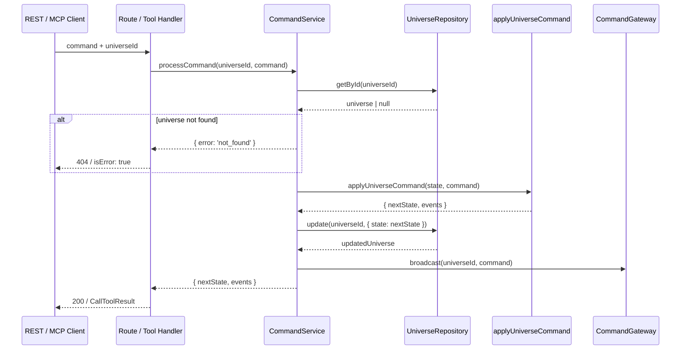
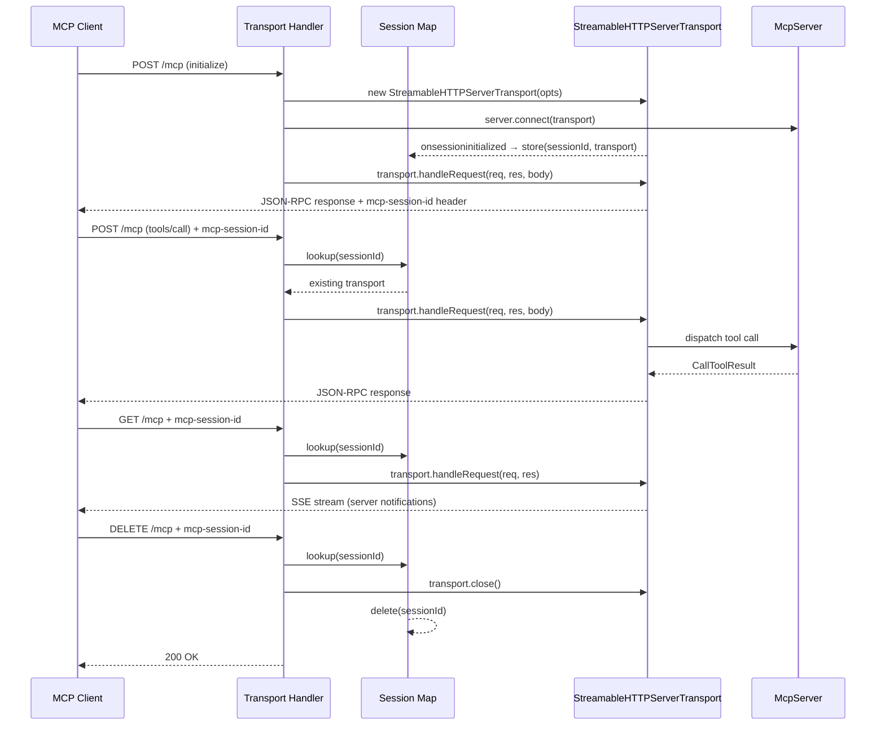

# Design: mcp-endpoints

## Technical Approach

This change introduces a `CommandService` as the central orchestrator for universe command processing, then layers an MCP server on top of it. The architecture follows the project's existing hexagonal pattern: ports define contracts, adapters implement them, and routes/transports are thin entry points that delegate to services.

The `CommandService` closes the current apply/persist gap by composing the two existing ports (`UniverseRepository` and `CommandGateway`) with the domain reducer (`applyUniverseCommand`). Both the refactored REST `POST /universes/:id/commands` endpoint and the new MCP tool handlers call the same service method, eliminating logic duplication.

The MCP server uses the official `@modelcontextprotocol/sdk` v1.x. Three tools are registered using the SDK's `server.tool()` API with Zod schemas. The SDK handles all JSON-RPC framing, tool discovery, and dispatch. Transport is provided by `StreamableHTTPServerTransport`, mounted at `/mcp` on the existing Express app via standard route handlers for POST, GET, and DELETE.

This design keeps all new code in two new directories (`apps/api/src/app/services/` and `apps/api/src/mcp/`) plus modifications to two existing files (`commands.ts` route and `app.ts` wiring). The `createApp` function signature is unchanged — `CommandService` is constructed internally from the two injected ports.

---

## Architecture Decisions

### Decision 1: Introduce a Service Layer for Command Processing

**Description**: Create `CommandService` as an explicit service class that encapsulates the full command lifecycle: fetch universe → apply reducer → persist state → broadcast command → return result.

**Rationale**: The current codebase has no service layer — routes call ports directly. This works for simple CRUD (see `universes.ts`) but breaks down when an operation requires coordination across multiple ports and the domain reducer. Without a service, the apply/persist/broadcast logic would need to be duplicated in both the REST handler and each MCP tool handler.

**Alternatives considered**:
- **Inline logic in handlers**: Duplicates the fetch→apply→persist→broadcast pipeline in two places (REST + MCP). Violates DRY and makes the pipeline harder to test.
- **Higher-order function / middleware**: Extract as a composable function that wraps request handling. More functional but less discoverable; doesn't match the project's stated `routes → services → repositories` convention in `config.yaml`.
- **Keep routes calling ports directly, add apply logic only to MCP**: Creates divergent code paths — the REST endpoint stays fire-and-forget while MCP applies and persists. Inconsistent semantics.

**Choice**: Explicit `CommandService` module. Aligns with the layered convention, is easily testable in isolation, and provides a single integration point for all command producers.

---

### Decision 2: Use Official MCP SDK with Streamable HTTP Transport

**Description**: Use `@modelcontextprotocol/sdk` v1.x (`McpServer` + `StreamableHTTPServerTransport`) rather than hand-rolling MCP-like REST endpoints.

**Rationale**: The SDK provides protocol-compliant JSON-RPC framing, automatic `tools/list` responses, input validation dispatch, and the `CallToolResult` response format. Hand-rolling this would require reimplementing the MCP protocol wire format, session management, and error conventions — all of which the SDK handles correctly.

**Alternatives considered**:
- **Custom REST endpoints** (`POST /mcp/tools/call`, `GET /mcp/tools/list`): Simpler initial implementation, no new dependency. But non-compliant with MCP protocol; cannot be discovered by standard MCP clients (Claude Desktop, MCP Inspector). Requires manual JSON-RPC framing.
- **SSE-only transport** (`SSEServerTransport`): The SDK also offers SSE transport, but Streamable HTTP is the recommended transport for new servers. SSE transport is being deprecated in the SDK.

**Choice**: Official SDK with Streamable HTTP. Standards-compliant, discoverable by any MCP client, and the SDK dependency is well-maintained and modest in size.

---

### Decision 3: Stateful MCP Sessions

**Description**: Use `sessionIdGenerator: () => randomUUID()` for stateful transport, tracking active sessions in a `Map<string, StreamableHTTPServerTransport>`.

**Rationale**: The `send_universe_command` tool has side effects (persists state, broadcasts). Stateful sessions allow proper session lifecycle management (initialize → use → terminate) and enable the SSE notification stream (`GET /mcp`) for server-initiated messages.

**Alternatives considered**:
- **Stateless transport**: Simpler, no session tracking. But `send_universe_command` has side effects, and stateless mode cannot support server-to-client notifications or session resumption. The SDK recommends stateful mode for servers with side effects.

**Choice**: Stateful sessions. Appropriate for the side-effect nature of command tools. Session cleanup is straightforward — `DELETE /mcp` closes the transport, and the `onclose` callback removes it from the map.

---

### Decision 4: Mount MCP at `/mcp` (Single Path, Multiple Methods)

**Description**: All MCP transport handlers are mounted at a single path `/mcp` with method-based dispatch: POST for client messages, GET for SSE stream, DELETE for session termination.

**Rationale**: This is the canonical mounting pattern for `StreamableHTTPServerTransport`. The SDK's transport handler expects all three methods at the same path. Using a single path avoids path-prefix conflicts with existing routes (all existing routes are under `/universes` or `/health`).

**Alternatives considered**:
- **Nested path** (`/api/mcp` or `/v1/mcp`): Adds unnecessary nesting. The existing routes don't use an `/api` prefix, so `/mcp` is consistent.
- **Separate paths per method**: Would require splitting the SDK transport handler, which isn't how it's designed to work.

**Choice**: `/mcp` — clean, collision-free, matches SDK expectations.

---

### Decision 5: Zod Schemas for MCP Tool Input Validation (Not Reusing JSON Schema from Content Module)

**Description**: Define Zod schemas inline in `server.tool()` calls for MCP tool input validation, rather than converting the existing JSON Schema definitions from `apps/api/src/content/mcp-tools.ts`.

**Rationale**: The MCP SDK's `server.tool()` API accepts Zod schemas natively and converts them to JSON Schema for `tools/list` responses. Writing Zod schemas directly is idiomatic for the SDK and avoids a JSON-Schema-to-Zod conversion step. The MCP tool inputs are simple (`universeId`, `command` with `type` field) — the Zod schemas are minimal.

**Alternatives considered**:
- **Convert existing JSON Schema to Zod**: The `mcp-tools.ts` file has detailed JSON Schema definitions. But converting complex `oneOf`/`$defs` schemas to Zod is fragile and error-prone. The SDK would then convert the Zod back to JSON Schema for `tools/list` — a round-trip with no benefit.
- **Use `server.tool()` with raw JSON Schema**: The SDK's `server.tool()` overload accepts raw JSON Schema objects directly (bypassing Zod). This would allow reusing the existing schemas but loses type-safe input parsing in handlers.

**Choice**: Zod schemas for MCP tool registration. Keep `mcp-tools.ts` as a reference/documentation artifact. The `send_universe_command` tool uses `z.object({ type: z.string() }).passthrough()` for the command object — deep validation is delegated to the domain reducer's exhaustiveness checking, consistent with the proposal's scope.

---

### Decision 6: CommandService as a Plain Object (Not a Class)

**Description**: Implement `CommandService` as a factory function returning an object with a `processCommand` method, following the project's existing factory-function pattern.

**Rationale**: Every dependency in the codebase uses factory functions (`createInMemoryUniverseRepository`, `createInMemoryCommandGateway`, `createUniverseRouter`, `createCommandsRouter`). Using a class would be inconsistent.

**Alternatives considered**:
- **ES6 class with constructor injection**: More familiar OOP pattern but inconsistent with the project's functional style.

**Choice**: Factory function `createCommandService(deps)` returning `{ processCommand }`.

---

### Decision 7: Commands Router Accepts CommandService (Replacing CommandGateway for POST)

**Description**: Change `createCommandsRouter` to accept `CommandService` in addition to `CommandGateway`. The POST handler delegates to `commandService.processCommand()`. The SSE stream handler continues to use `CommandGateway` directly for subscriptions.

**Rationale**: The POST handler needs the full apply/persist pipeline (via `CommandService`). The SSE handler only needs `gateway.subscribe()` — it is a read-only consumer of broadcasts, not a command producer. Passing both dependencies makes this separation explicit.

**Alternatives considered**:
- **Pass only CommandService, have it expose a subscribe method**: Would require `CommandService` to re-export gateway subscription, coupling it to the SSE concern. The service should focus on command processing, not subscription management.
- **Pass only CommandGateway, call CommandService from outside**: Unclear ownership — who calls the service?

**Choice**: `createCommandsRouter(commandService, gateway)` — the POST handler uses the service, the SSE handler uses the gateway.

---

## Data Flow

### Command Processing Pipeline (Shared)



### MCP Transport Session Lifecycle



### App Wiring Overview

```
createApp(universeRepo, commandGateway)
│
├─ commandService = createCommandService({ universeRepo, commandGateway })
│
├─ mcpServer = createMcpServer({ universeRepo, commandService })
│
├─ app.use(healthRouter)
├─ app.use(createUniverseRouter(universeRepo))
├─ app.use(createCommandsRouter(commandService, commandGateway))
└─ app.use('/mcp', createMcpTransportHandler(mcpServer))
```

---

## File Changes Table

| File | Action | Purpose |
|---|---|---|
| `apps/api/src/app/services/commandService.ts` | **Create** | Shared command processing: fetch → apply → persist → broadcast |
| `apps/api/src/mcp/server.ts` | **Create** | MCP server factory: instantiate `McpServer`, register 3 tools |
| `apps/api/src/mcp/transport.ts` | **Create** | Streamable HTTP transport: Express handlers for POST/GET/DELETE, session map |
| `apps/api/src/routes/commands.ts` | **Modify** | POST handler delegates to `CommandService`; accept both service and gateway |
| `apps/api/src/app.ts` | **Modify** | Build `CommandService`, build MCP server, mount MCP transport, update router call |
| `apps/api/package.json` | **Modify** | Add `@modelcontextprotocol/sdk` and `zod` dependencies |

### Files NOT changed (consumed only)

| File | Role |
|---|---|
| `packages/domain/src/universe/applyCommand.ts` | Pure reducer — imported by `CommandService` |
| `packages/domain/src/universe/commands.ts` | `UniverseCommand` type — imported by `CommandService` |
| `packages/domain/src/universe/state.ts` | `UniverseState` type — imported for typing |
| `apps/api/src/app/ports/universeRepository.ts` | Port interface — injected into `CommandService` |
| `apps/api/src/app/ports/commandGateway.ts` | Port interface — injected into `CommandService` |
| `apps/api/src/content/mcp-tools.ts` | Static tool defs — reference only; MCP SDK generates its own schemas from Zod |
| `apps/api/src/server.ts` | Bootstrap — no changes; ports already built and passed to `createApp` |
| `apps/api/src/routes/universes.ts` | CRUD routes — unchanged |
| `apps/api/src/routes/health.ts` | Health route — unchanged |

---

## Interfaces / Contracts

### CommandService (`apps/api/src/app/services/commandService.ts`)

```typescript
import type { UniverseCommand, CommandResult } from '@solar/domain';
import type { UniverseRepository } from '../ports/universeRepository.js';
import type { CommandGateway } from '../ports/commandGateway.js';

export interface CommandServiceDeps {
  universeRepo: UniverseRepository;
  commandGateway: CommandGateway;
}

export interface CommandService {
  processCommand(universeId: string, command: UniverseCommand): Promise<CommandResult>;
}

export function createCommandService(deps: CommandServiceDeps): CommandService;
```

**`processCommand` behavior**:
1. Call `deps.universeRepo.getById(universeId)` — if `null`, throw a `UniverseNotFoundError` (or return a typed error result).
2. Call `applyUniverseCommand(universe.state, command)` — returns `{ nextState, events }`.
3. Call `deps.universeRepo.update(universeId, { state: nextState })`.
4. Call `deps.commandGateway.broadcast(universeId, command)`.
5. Return `{ nextState, events }`.

**Error type** for universe-not-found:

```typescript
export class UniverseNotFoundError extends Error {
  constructor(public readonly universeId: string) {
    super(`Universe not found: ${universeId}`);
    this.name = 'UniverseNotFoundError';
  }
}
```

Using a custom error class (rather than returning a result type) aligns with the project's existing try/catch + `next(err)` pattern in route handlers. The error class name enables typed catch blocks.

---

### MCP Server Factory (`apps/api/src/mcp/server.ts`)

```typescript
import { McpServer } from '@modelcontextprotocol/sdk/server/mcp.js';
import type { UniverseRepository } from '../app/ports/universeRepository.js';
import type { CommandService } from '../app/services/commandService.js';

export interface McpServerDeps {
  universeRepo: UniverseRepository;
  commandService: CommandService;
}

export function createMcpServer(deps: McpServerDeps): McpServer;
```

**Tool registrations inside `createMcpServer`**:

#### `get_universe_state`

```typescript
server.tool(
  'get_universe_state',
  'Retrieve the current state snapshot of a universe.',
  { universeId: z.string().describe('Unique identifier of the universe') },
  async ({ universeId }) => {
    const universe = await deps.universeRepo.getById(universeId);
    if (!universe) {
      return {
        content: [{ type: 'text', text: JSON.stringify({ error: 'Universe not found', universeId }) }],
        isError: true,
      };
    }
    return {
      content: [{ type: 'text', text: JSON.stringify(universe.state) }],
    };
  }
);
```

#### `list_universe_commands`

```typescript
server.tool(
  'list_universe_commands',
  'List available command types for a universe.',
  {
    universeId: z.string().describe('Unique identifier of the target universe'),
    category: z.string().optional().describe('Filter by command category'),
  },
  async ({ universeId, category }) => {
    // Verify universe exists
    const universe = await deps.universeRepo.getById(universeId);
    if (!universe) {
      return {
        content: [{ type: 'text', text: JSON.stringify({ error: 'Universe not found', universeId }) }],
        isError: true,
      };
    }
    // Return static command listing (defined inline or imported)
    const listing = getCommandListing(category);
    return {
      content: [{ type: 'text', text: JSON.stringify(listing) }],
    };
  }
);
```

#### `send_universe_command`

```typescript
server.tool(
  'send_universe_command',
  'Send a command to mutate a universe.',
  {
    universeId: z.string().describe('Unique identifier of the target universe'),
    command: z.object({ type: z.string() }).passthrough().describe('Command object with type discriminator'),
  },
  async ({ universeId, command }) => {
    try {
      const result = await deps.commandService.processCommand(
        universeId,
        command as UniverseCommand,
      );
      return {
        content: [{ type: 'text', text: JSON.stringify({ nextState: result.nextState, events: result.events }) }],
      };
    } catch (err) {
      if (err instanceof UniverseNotFoundError) {
        return {
          content: [{ type: 'text', text: JSON.stringify({ error: 'Universe not found', universeId }) }],
          isError: true,
        };
      }
      return {
        content: [{ type: 'text', text: JSON.stringify({ error: 'Command processing failed', message: String(err) }) }],
        isError: true,
      };
    }
  }
);
```

---

### MCP Transport Handler (`apps/api/src/mcp/transport.ts`)

```typescript
import { Router } from 'express';
import type { McpServer } from '@modelcontextprotocol/sdk/server/mcp.js';

export function createMcpTransportHandler(server: McpServer): Router;
```

**Internal session state**:

```typescript
const sessions = new Map<string, StreamableHTTPServerTransport>();
```

**POST handler** (client → server JSON-RPC messages):

```typescript
router.post('/', async (req, res) => {
  const sessionId = req.headers['mcp-session-id'] as string | undefined;

  if (sessionId && sessions.has(sessionId)) {
    // Existing session — route to its transport
    const transport = sessions.get(sessionId)!;
    await transport.handleRequest(req, res, req.body);
    return;
  }

  if (isInitializeRequest(req.body)) {
    // New session — create transport, connect server
    const transport = new StreamableHTTPServerTransport({
      sessionIdGenerator: () => randomUUID(),
      onsessioninitialized: (id) => { sessions.set(id, transport); },
    });
    transport.onclose = () => {
      const id = [...sessions.entries()].find(([, t]) => t === transport)?.[0];
      if (id) sessions.delete(id);
    };
    await server.connect(transport);
    await transport.handleRequest(req, res, req.body);
    return;
  }

  // Non-initialize request without valid session
  res.status(400).json({ error: 'Bad request: no valid session' });
});
```

**GET handler** (server → client SSE notifications):

```typescript
router.get('/', async (req, res) => {
  const sessionId = req.headers['mcp-session-id'] as string | undefined;
  if (!sessionId || !sessions.has(sessionId)) {
    res.status(400).json({ error: 'Invalid or missing session' });
    return;
  }
  const transport = sessions.get(sessionId)!;
  await transport.handleRequest(req, res);
});
```

**DELETE handler** (session termination):

```typescript
router.delete('/', async (req, res) => {
  const sessionId = req.headers['mcp-session-id'] as string | undefined;
  if (!sessionId || !sessions.has(sessionId)) {
    res.status(400).json({ error: 'Invalid or missing session' });
    return;
  }
  const transport = sessions.get(sessionId)!;
  await transport.close();
  sessions.delete(sessionId);
  res.status(200).json({ ok: true });
});
```

---

### Refactored Commands Router (`apps/api/src/routes/commands.ts`)

```typescript
import type { CommandService } from '../app/services/commandService.js';
import type { CommandGateway } from '../app/ports/commandGateway.js';

export function createCommandsRouter(commandService: CommandService, gateway: CommandGateway): Router;
```

**POST handler change**:

```typescript
// Before:  gateway.broadcast(req.params.id, command);
//          res.status(202).json({ ok: true });

// After:
const result = await commandService.processCommand(req.params.id, command);
res.status(200).json({ nextState: result.nextState, events: result.events });
```

**Error handling in POST**:

```typescript
try {
  const result = await commandService.processCommand(req.params.id, command);
  res.status(200).json({ nextState: result.nextState, events: result.events });
} catch (err) {
  if (err instanceof UniverseNotFoundError) {
    res.status(404).json({ error: 'Universe not found' });
    return;
  }
  next(err);
}
```

**SSE handler**: Unchanged — continues to use `gateway.subscribe()` directly.

---

### Updated App Wiring (`apps/api/src/app.ts`)

```typescript
import { createCommandService } from './app/services/commandService.js';
import { createMcpServer } from './mcp/server.js';
import { createMcpTransportHandler } from './mcp/transport.js';

export function createApp(universeRepo: UniverseRepository, commandGateway: CommandGateway) {
  const app = express();

  // Build service layer
  const commandService = createCommandService({ universeRepo, commandGateway });

  // Build MCP server
  const mcpServer = createMcpServer({ universeRepo, commandService });

  // Middleware
  app.use(cors({ origin: ALLOWED_ORIGINS }));
  app.use(express.json({ limit: '10mb' }));

  // Routes
  app.use(healthRouter);
  app.use(createUniverseRouter(universeRepo));
  app.use(createCommandsRouter(commandService, commandGateway));
  app.use('/mcp', createMcpTransportHandler(mcpServer));

  // Error handler (unchanged)
  // ...

  return app;
}
```

The `createApp` function signature remains `(universeRepo, commandGateway)` — no breaking change to `server.ts`.

---

## Testing Strategy

### Unit Tests

| Component | What to test | Mocks |
|---|---|---|
| `CommandService.processCommand` | Happy path: fetches, applies, persists, broadcasts, returns result | Mock `UniverseRepository` and `CommandGateway` |
| `CommandService.processCommand` | Universe not found: throws `UniverseNotFoundError` | Mock `repo.getById` → `null` |
| `CommandService.processCommand` | Reducer error: domain reducer throws → error propagates | Mock repo to return a universe, use a malformed command |

### Integration Tests

| Scenario | Method |
|---|---|
| `POST /universes/:id/commands` returns 200 with applied state | HTTP test against `createApp` with in-memory adapters |
| `POST /universes/:id/commands` returns 404 for unknown universe | HTTP test |
| `POST /mcp` initialize → `tools/list` → `tools/call` for each tool | HTTP test with JSON-RPC payloads |
| MCP session lifecycle: POST init → POST tool call → DELETE | HTTP test verifying session creation and cleanup |
| SSE stream still works after command route refactor | HTTP test for `GET /universes/:id/events` |

### Manual Verification

| Check | Tool |
|---|---|
| MCP Inspector can connect and list tools | `npx @modelcontextprotocol/inspector` → `http://localhost:<port>/mcp` |
| All 3 tools callable from Inspector | Interactive MCP Inspector session |
| `npm run build` passes | CI / local build |

---

## Migration / Rollout Plan

### Phase 1: Foundation (no behavioral change)

1. Install dependencies (`@modelcontextprotocol/sdk`, `zod`).
2. Create `CommandService` with `processCommand`.
3. Verify with unit tests.

### Phase 2: MCP Server (additive)

1. Create `apps/api/src/mcp/server.ts` with tool registration.
2. Create `apps/api/src/mcp/transport.ts` with session management.
3. Mount at `/mcp` in `app.ts`.
4. Existing endpoints unaffected — MCP is purely additive.

### Phase 3: Command Route Refactor (behavioral change)

1. Update `createCommandsRouter` signature to accept `CommandService`.
2. Refactor POST handler to use `commandService.processCommand()`.
3. Response changes from `202 { ok: true }` to `200 { nextState, events }`.
4. Update `createApp` to pass `commandService` to commands router.

### Backward Compatibility

- The `POST /commands` semantic change (202 → 200) is intentional and accepted per the proposal.
- The only known consumer is the frontend SSE-connected UI, which currently ignores the POST response body.
- The SSE stream (`GET /universes/:id/events`) continues to work unchanged — the `CommandService` still calls `gateway.broadcast()`, so SSE subscribers receive commands as before.
- All existing REST endpoints are unchanged.

### Rollback

Per the proposal's rollback plan: remove MCP modules (steps 1–2 for partial), revert `commands.ts` (step 4 for full). No database migrations to revert.

---

## Open Questions

1. **Command listing source**: The `list_universe_commands` tool needs a static command category listing. Should this be a hardcoded data structure in `mcp/server.ts`, or should it be extracted from the existing `mcp-tools.ts` content module? **Recommendation**: Define a lightweight `COMMAND_CATEGORIES` constant in `mcp/server.ts` (or a small helper file) with the 10 categories and their command types. The content module's JSON Schema is too detailed for this purpose — the listing is a human-readable summary, not a schema.

2. **MCP server `connect` per session**: The `StreamableHTTPServerTransport` requires calling `server.connect(transport)` for each new session. The `McpServer` supports multiple simultaneous connections. This is the intended usage per SDK documentation, but worth noting that each session creates a new protocol-level connection to the same server instance.
