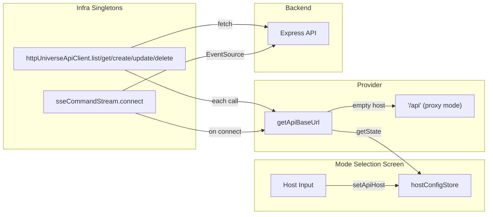

# Design: host-config-health-check

**Change name:** `host-config-health-check`
**Date:** 2026-02-25
**Status:** Designed
**Approach:** B — Zustand config store + new provider abstraction (from exploration)

---

## Technical Approach

This change adds runtime API host configuration and a live health-check semaphore to the mode selection screen. The design introduces three new modules — a Zustand store, a base-URL provider, and a custom hook — and surgically modifies four existing files. The total scope is 7 files (3 new, 4 modified), all within `apps/web/`.

The core architectural idea is a **thin provider abstraction** that sits between consumers of the API base URL (`httpUniverseApiClient`, `sseCommandStream`) and the source of that URL. Today both infra modules call their own `resolveBaseUrl()` which reads `import.meta.env.VITE_API_BASE_URL` at factory-call time. The new `apiBaseUrlProvider` module exports a single `getApiBaseUrl()` function that reads from a Zustand store with an automatic fallback to the compile-time env var. The existing factory functions are modified to call `getApiBaseUrl()` at the point of each network request (not at singleton creation time), making the URL dynamic without changing the singleton lifecycle.

On the UI side, `ModeSelectionScreen` gains a "Server" configuration row between the subtitle and the mode cards. It contains a text input bound to the store, a semaphore dot (green/yellow/red), and a conditionally-visible error button. A new `useHealthCheck` hook encapsulates the fetch-to-`/health` lifecycle with debouncing, timeout, and tri-state status management.

The change is purely additive and frontend-only. No backend modifications are required. The default behavior (user does not touch the host input) is identical to the current behavior — `getApiBaseUrl()` returns the compile-time value, and the singleton factories behave exactly as they do today.

---

## Architecture Decisions

### Decision 1: Per-request URL resolution vs. singleton-level URL capture

**Description:** Should the infra singletons (`httpUniverseApiClient`, `sseCommandStream`) resolve the base URL once at creation time (current behavior) or on every network call?

**Rationale:** The current pattern captures `baseUrl` in a closure variable inside `createHttpUniverseApiClient()` (line 48 of `httpUniverseApiClient.ts`). This makes the URL immutable for the lifetime of the singleton. To support runtime changes from the host input, the URL must be resolved lazily at call time.

**Alternatives considered:**
- **(A) Recreate singletons when host changes.** The `universeApiClientProvider.ts` would expose a mutable reference, and `hostConfigStore` subscribers would call a `recreateClient()` function. **Rejected:** adds lifecycle complexity; all consumers of the client would need to handle reference changes; the SSE stream singleton cannot be swapped mid-connection.
- **(B) Per-request resolution via provider function.** Each `fetch()` call inside the client calls `getApiBaseUrl()` instead of reading a captured closure variable. **Chosen.** Minimal change — remove the `const baseUrl = resolveBaseUrl()` from the factory wrapper and inline `getApiBaseUrl()` into each method. The call is synchronous (reads Zustand store's `getState()`), so there is no async overhead.
- **(C) Proxy pattern wrapping the client.** A `Proxy` object that intercepts method calls and injects the current URL. **Rejected:** over-engineered for the use case; TypeScript typing becomes awkward.

**Choice:** **(B)** — Per-request resolution. Each `fetch` and `new EventSource` call reads `getApiBaseUrl()` at invocation time.

---

### Decision 2: Provider module location and API

**Description:** Where does `getApiBaseUrl()` live, and what is its contract?

**Rationale:** Both `httpUniverseApiClient.ts` (under `infra/api/`) and `sseCommandStream.ts` (under `infra/realtime/`) need to call it. Placing the provider under `infra/api/` (as `apiBaseUrlProvider.ts`) is appropriate because it governs the API base URL — SSE endpoints are served by the same API host. The function reads the Zustand store value synchronously via `useHostConfigStore.getState().apiHost`: when the host is non-empty, it returns the host as-is (no `/api` suffix — backend routes are at root level); when the host is empty, it returns `'/api'` for Vite proxy mode.

**Alternatives considered:**
- **(A) Place under `infra/` root (not inside `api/` or `realtime/`).** **Rejected:** the existing convention keeps api-related infra under `infra/api/`. A shared concern between `api/` and `realtime/` is fine to host in `api/` since the URL is the API host URL.
- **(B) Place under `state/` alongside the store.** **Rejected:** the provider is infrastructure (URL resolution), not state management. It reads the store but is not a store itself.
- **(C) Export from `hostConfigStore.ts` itself.** **Rejected:** violates single-responsibility. The store manages state; the provider resolves a derived value with fallback logic.

**Choice:** New file at `apps/web/src/infra/api/apiBaseUrlProvider.ts` exporting a single named function `getApiBaseUrl(): string`.

---

### Decision 3: Health-check hook vs. store-managed health state

**Description:** Should the health-check state (status, error message) live in the Zustand store or in a local React hook?

**Rationale:** The health check is relevant only while the `ModeSelectionScreen` is mounted. Once the user selects a mode and leaves the screen, the health status has no consumers. Storing it globally in Zustand would be wasteful and create stale state that persists after unmount. A custom hook with `useState` + `useEffect` scoped to the component lifecycle is the right granularity.

**Alternatives considered:**
- **(A) Add health state to `hostConfigStore`.** Fields like `healthStatus`, `healthError`, `checkHealth()`. **Rejected:** bloats the store with transient UI state; requires manual cleanup when the screen unmounts; mixes configuration (host URL) with runtime observation (health status).
- **(B) Separate `healthCheckStore`.** A new Zustand store dedicated to health-check state. **Rejected:** adds a store for state that has exactly one consumer and a trivial lifecycle. Over-engineering per the config.yaml design rules.
- **(C) Custom hook with local state.** `useHealthCheck(baseUrl)` returns `{ status, error }` and manages fetch lifecycle internally. **Chosen.** Follows the pattern of `useRemoteCommandStream` which manages SSE lifecycle in a hook. State is local, cleanup is automatic on unmount, and the hook is easily testable in isolation.

**Choice:** **(C)** — New custom hook `useHealthCheck` at `apps/web/src/hooks/useHealthCheck.ts`.

---

### Decision 4: Debounce strategy for host input changes

**Description:** How to avoid firing a health check on every keystroke when the user edits the host URL.

**Rationale:** The user might type `http://192.168.1.100:3001` which is 26 characters. Without debouncing, 26 health-check requests would fire. A debounce of 500ms after the last keystroke is standard for input-driven network calls.

**Alternatives considered:**
- **(A) No debounce; check on blur only.** Fire the health check when the input loses focus. **Rejected:** the user expects live feedback as they type (the semaphore concept implies continuous status); blur-only creates a confusing delay where the semaphore shows stale state while typing.
- **(B) Debounce inside the hook.** The `useHealthCheck` hook accepts the raw URL and internally applies a debounce via `setTimeout`/`clearTimeout` in a `useEffect`. **Chosen.** Keeps debounce logic co-located with the fetch logic. No external debounce utility needed (the project has no lodash/utility dependency).
- **(C) Debounce the store update.** The `setApiHost` action applies debounce before writing to the store. **Rejected:** the store should reflect the current input value immediately (for binding the input's `value` prop). Debouncing at the store level would cause the input to lag.

**Choice:** **(B)** — Debounce inside `useHealthCheck` with a 500ms delay. The store always holds the latest typed value.

---

### Decision 5: Error overlay implementation

**Description:** How to display health-check error details.

**Rationale:** The codebase has no modal system. The `Window.tsx` component is a full desktop-window-manager paradigm (draggable, resizable) which is far too heavy for a small error message. The `RemoteCommandToast` is auto-dismissing and positioned globally. The simplest approach is an inline expandable `<div>` rendered conditionally below the semaphore row, styled to match the dark theme.

**Alternatives considered:**
- **(A) Reuse `Window.tsx`.** Open a small Window-managed panel. **Rejected:** requires the window store, taskbar integration, and full window chrome for a one-line error message. Massive over-engineering.
- **(B) Absolute-positioned tooltip/popover.** A small box positioned relative to the "View Error" button. **Rejected:** positioning logic adds complexity; can clip at screen edges; requires z-index management on the mode selection screen.
- **(C) Inline expandable section.** A `<div>` with `display: none / block` toggled by a boolean state, rendered directly below the server config row. **Chosen.** Zero positioning complexity; natural document flow; matches the dark theme with a bordered box.

**Choice:** **(C)** — Inline expandable error detail section, toggled by local state.

---

### Decision 6: `hostConfigStore` default initialization

**Description:** How the store initializes its `apiHost` value.

**Rationale:** The store must default to the compile-time env var so that the provider function returns the correct URL even if the store is read before the `ModeSelectionScreen` mounts. This covers the module initialization order risk identified in the exploration.

**Alternatives considered:**
- **(A) Default to empty string `''`, let provider handle fallback.** The provider would check `if (!storeValue) return import.meta.env...`. **Rejected:** creates ambiguity — is empty string "user cleared the input" or "store not initialized yet"? The provider must differentiate, adding fragile logic.
- **(B) Default to `import.meta.env.VITE_API_BASE_URL ?? '/api'`.** The store initializes with the env var value. The provider simply returns the store value and normalizes it. **Chosen.** No ambiguity. The store always has a meaningful value. The input field is always pre-filled.

**Choice:** **(B-revised)** — Store defaults to `import.meta.env.VITE_API_HOST ?? ''`. An empty string means proxy mode; a non-empty value is a host origin like `http://localhost:3001`. The env var name changed from `VITE_API_BASE_URL` to `VITE_API_HOST` to reflect that the store holds a host origin, not a path.

---

### Decision 7: Online mode card disabled when health is not green

**Description:** Should the Online mode card be clickable when the health check has not succeeded?

**Rationale:** Allowing the user to enter online mode with a failing health check leads to a broken experience (API calls fail immediately). Disabling the card when health is not `'healthy'` provides clear feedback that the server must be reachable before proceeding.

**Alternatives considered:**
- **(A) Informational only — semaphore is a hint, card always clickable.** This was the original design (REQ-NONBLOCK-1/2 in the initial spec). **Rejected after implementation review:** users consistently tried to enter online mode with a red semaphore and encountered confusing errors.
- **(B) Disable the Online card when health is not `'healthy'`.** Apply `disabled` attribute + `mode-card-disabled` CSS class (`opacity: 0.4`, `cursor: not-allowed`). Suppress hover/active effects via `:not(:disabled)` selector. **Chosen.** Clear, simple, and reversible.

**Choice:** **(B)** — Online mode card is disabled when `status !== 'healthy'`. Offline card is always enabled.

---

## Data Flow

### Health-check lifecycle (mount + host change)

```
ModeSelectionScreen mounts
        |
        v
  useHealthCheck(apiHost)
        |
        +--> [debounce 500ms] (skipped on initial mount — fires immediately)
        |
        v
  status = 'checking' (yellow dot)
        |
        v
  fetch(apiHost + '/health', { signal: AbortController, timeout: 5s })
        |
        +--- 200 + JSON { ok: true } --> status = 'healthy' (green dot)
        |
        +--- 200 + JSON { ok: false } --> status = 'error' (red dot)
        |                                  error = "Server reported not OK"
        |
        +--- non-200 status -----------> status = 'error' (red dot)
        |                                  error = "HTTP {status}: {statusText}"
        |
        +--- non-JSON response --------> status = 'error' (red dot)
        |                                  error = "Invalid response (not JSON)"
        |
        +--- network error / timeout --> status = 'error' (red dot)
        |                                  error = err.message (e.g. "Failed to fetch")
        |
        v
  User edits host input
        |
        v
  setApiHost(newValue) --> store updates
        |
        v
  useHealthCheck re-runs (debounced)
```

### Base URL resolution (runtime request flow)



### Component tree (mode selection screen)

```
ModeSelectionScreen
├── .mode-selection-header
│   ├── h1  "Solar System Constructor"
│   └── p   "Choose how you want to work"
├── .server-config-section  <── NEW
│   ├── .server-config-row
│   │   ├── label  "Server"
│   │   ├── input[type=text]  (bound to hostConfigStore.apiHost)
│   │   └── .health-semaphore
│   │       ├── .health-dot  (green | yellow | red)
│   │       ├── span.health-label  ("Healthy" | "Checking..." | "Unreachable")
│   │       └── button.health-error-btn  (visible only when red)
│   └── .health-error-detail  <── conditionally rendered
│       ├── p  (error message text)
│       └── button  "Dismiss"
└── .mode-selection-cards
    ├── button.mode-card  (Offline — always enabled)
    └── button.mode-card  (Online — disabled + .mode-card-disabled when status !== 'healthy')
```

---

## File Changes Table

| Path | Action | Purpose |
|------|--------|---------|
| `apps/web/src/state/hostConfigStore.ts` | **Add** | New Zustand store holding `apiHost` and `setApiHost`. Defaults to `import.meta.env.VITE_API_HOST ?? ''` (empty = proxy mode). |
| `apps/web/src/infra/api/apiBaseUrlProvider.ts` | **Add** | New provider exporting `getApiBaseUrl(): string`. Host set -> returns host directly; host empty -> returns `'/api'`. Strips trailing slashes. |
| `apps/web/src/hooks/useHealthCheck.ts` | **Add** | New custom hook: `useHealthCheck(baseUrl: string)` returning `{ status: HealthStatus; error: string | null }`. Manages fetch lifecycle with debounce, timeout, and AbortController cleanup. |
| `apps/web/src/infra/api/httpUniverseApiClient.ts` | **Modify** | Replace `resolveBaseUrl()` closure capture with per-request `getApiBaseUrl()` calls. Remove the standalone `resolveBaseUrl()` function. |
| `apps/web/src/infra/realtime/sseCommandStream.ts` | **Modify** | Replace `resolveBaseUrl()` closure capture with a `getApiBaseUrl()` call inside `connect()`. Remove the standalone `resolveBaseUrl()` function. |
| `apps/web/src/components/ModeSelectionScreen.tsx` | **Modify** | Add server config section with host input, semaphore indicator, error button, and error detail overlay. Import `useHostConfigStore` and `useHealthCheck`. |
| `apps/web/src/components/ModeSelectionScreen.css` | **Modify** | Add styles for `.server-config-section`, `.server-config-row`, `.health-semaphore`, `.health-dot`, `.health-label`, `.health-error-btn`, `.health-error-detail`. |

---

## Interfaces / Contracts

### `hostConfigStore` — `apps/web/src/state/hostConfigStore.ts`

```typescript
interface HostConfigStore {
  /** Current API host origin. Defaults to VITE_API_HOST or '' (empty = proxy mode). */
  apiHost: string;

  /** Update the API host origin. Called by the host input on the mode selection screen. */
  setApiHost: (url: string) => void;
}

export const useHostConfigStore: UseBoundStore<StoreApi<HostConfigStore>>;
```

### `apiBaseUrlProvider` — `apps/web/src/infra/api/apiBaseUrlProvider.ts`

```typescript
/**
 * Returns the current API base URL, normalized (trailing slashes stripped).
 *
 * Resolution:
 *   - Host non-empty (e.g. 'http://localhost:3001') → return host as-is
 *   - Host empty (proxy mode) → return '/api'
 *
 * The provider does NOT append '/api' to a direct host. Backend routes
 * are at root level (/health, /universes), not under /api. The /api prefix
 * is only a Vite dev proxy convention.
 */
export function getApiBaseUrl(): string;
```

### `useHealthCheck` — `apps/web/src/hooks/useHealthCheck.ts`

```typescript
type HealthStatus = 'idle' | 'checking' | 'healthy' | 'error';

interface HealthCheckResult {
  /** Current health-check status. */
  status: HealthStatus;
  /** Error message when status is 'error'; null otherwise. */
  error: string | null;
}

/**
 * Fetches GET {baseUrl}/health and returns tri-state status.
 *
 * - Runs immediately on mount with the initial baseUrl.
 * - Re-runs with a 500ms debounce when baseUrl changes.
 * - Uses AbortController to cancel in-flight requests on cleanup or re-run.
 * - Applies a 5-second timeout via AbortSignal.timeout (with fallback for
 *   browsers that don't support it).
 */
export function useHealthCheck(baseUrl: string): HealthCheckResult;
```

### Modified: `httpUniverseApiClient` factory signature (unchanged externally)

The factory `createHttpUniverseApiClient()` continues to return `UniverseApiClient`. Internally, each method body changes from:

```typescript
// Before (closure capture)
export function createHttpUniverseApiClient(): UniverseApiClient {
  const baseUrl = resolveBaseUrl();
  return {
    async list() {
      const res = await fetch(`${baseUrl}/universes`);
      // ...
```

To:

```typescript
// After (per-request resolution)
import { getApiBaseUrl } from './apiBaseUrlProvider';

export function createHttpUniverseApiClient(): UniverseApiClient {
  return {
    async list() {
      const baseUrl = getApiBaseUrl();
      const res = await fetch(`${baseUrl}/universes`);
      // ...
```

### Modified: `sseCommandStream` factory (analogous change)

```typescript
// After
import { getApiBaseUrl } from '../api/apiBaseUrlProvider';

export function createSseCommandStream(): CommandStream {
  return {
    connect(universeId, onCommand, options) {
      const baseUrl = getApiBaseUrl();
      const url = `${baseUrl}/universes/${encodeURIComponent(universeId)}/events`;
      // ... rest unchanged
```

### Health endpoint contract (existing, no changes)

```
GET {baseUrl}/health
Response 200: { "ok": true, "uptime": <number> }
Response non-200 or network error: treated as unhealthy
```

---

## Testing Strategy

The project currently has no test runner configured (noted in exploration). All verification is manual.

### Manual verification plan

1. **Default behavior (no interaction with host input):**
   - Start dev server (`npm run dev:web` + `npm run dev:api`).
   - Load the mode selection screen.
   - Verify the host input is empty with placeholder `http://localhost:3001`.
   - Verify the semaphore turns green within a few seconds (proxy mode health check to `/api/health`).
   - Verify the Online card becomes enabled when green.
   - Select Online mode; verify universe browser loads normally.
   - Select Offline mode; verify the editor loads normally.

2. **Custom host (backend running):**
   - Change the host input to `http://localhost:3001`.
   - Verify the semaphore turns yellow, then green.
   - Verify the Online card is enabled.
   - Select Online mode; verify API calls work against the direct URL (no `/api` prefix).

3. **Custom host (backend not running):**
   - Stop the backend.
   - Change the host input to `http://localhost:3001`.
   - Verify the semaphore turns yellow, then red.
   - Verify the "View Error" button appears.
   - Click "View Error"; verify the error detail shows a meaningful message.
   - Click "Dismiss"; verify the error detail hides.

4. **Invalid URL:**
   - Type `not-a-url` into the host input.
   - Verify the semaphore turns red with a network error message.

5. **Debounce behavior:**
   - Type a URL character by character.
   - Verify the health check does not fire on every keystroke (observe network tab).
   - Verify it fires ~500ms after the last keystroke.

6. **Health check on mount:**
   - Reload the page.
   - Verify the health check fires automatically with the default host.

7. **Build verification:**
   - Run `npm run build` — must pass with no errors.
   - Run `npm run typecheck` — must pass with no errors.

### Future testing considerations (out of scope)

When a test runner is added, the `useHealthCheck` hook is a good candidate for unit tests with `msw` (Mock Service Worker) or a similar fetch-mocking library. The `apiBaseUrlProvider` is trivially testable by mocking the Zustand store.

---

## Migration / Rollout Plan

This change is **non-breaking and additive**. No migration is required.

- **Phase 1 (this change):** Ship all 7 file changes. Default behavior is identical to current behavior. The host input is visible but pre-filled with the existing URL. Users who do not interact with the input experience zero change.
- **Phase 2 (future, out of scope):** Add localStorage persistence to `hostConfigStore` using Zustand's `persist` middleware. This would remember the user's preferred host across sessions.
- **Phase 3 (future, out of scope):** Add an "Advanced" toggle to collapse/expand the server config section for a cleaner default UX.

**Rollback:** Revert the commit. All changes are additive and isolated to the frontend. No data migrations, no backend changes, no shared-package changes.

---

## Open Questions

1. **Should the health check URL include the `/api` prefix when using the default Vite proxy path?**
   Resolution: In proxy mode (host is empty), the provider returns `/api`, so the health check calls `/api/health`. The Vite proxy rewrites this to `http://localhost:3001/health`. When a direct host is set (e.g. `http://localhost:3001`), the provider returns the host as-is, so the health check calls `http://localhost:3001/health` directly. The provider does NOT append `/api` to direct hosts because backend routes are at root level.

2. **AbortSignal.timeout browser support.**
   `AbortSignal.timeout()` is available in Chrome 103+, Firefox 100+, Safari 16+. For older browsers, the hook should implement a manual timeout via `setTimeout` + `AbortController.abort()`. The implementation should use `AbortSignal.timeout()` with a try-catch fallback.

3. **Should the health-check response body be validated beyond `ok: true`?**
   Resolution: The hook should verify that the response is JSON and contains `ok: true`. Any other response shape (even a 200 with unexpected JSON) should be treated as a warning or error. For this iteration, a 200 with parseable JSON containing `ok: true` is green; everything else is red. There is no yellow/warning semantic beyond the transient "checking" state.

---

## Appendix: CSS Pattern Reference

The semaphore dot in `ModeSelectionScreen.css` should follow the exact color and animation values established in `ConnectionStatusIndicator.css`:

| State | Dot color | Glow | Animation | Label color |
|-------|-----------|------|-----------|-------------|
| Healthy (green) | `#44cc77` | `rgba(68,204,119,0.5)` | none | `#44cc77` |
| Checking (yellow) | `#ffaa00` | `rgba(255,170,0,0.5)` | `connectionPulse 1.2s ease-in-out infinite` | `#ffaa00` |
| Error (red) | `#ff5555` | `rgba(255,85,85,0.5)` | `connectionPulse 1.2s ease-in-out infinite` | `#ff5555` |
| Idle | hidden | - | - | - |

The pulse keyframes can be duplicated into `ModeSelectionScreen.css` (to avoid coupling to `ConnectionStatusIndicator.css`) or extracted into a shared CSS file. Since the project does not use CSS modules or a shared utility CSS layer, **duplicating the 6-line keyframes** is the pragmatic choice to keep components independent. This matches the existing convention where each component owns its CSS.
